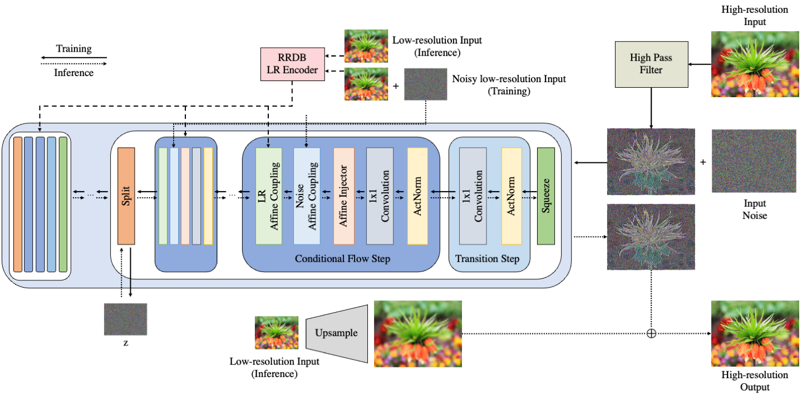

# FS-NCSR
Official PyTorch implementation of "FS-NCSR: Increasing Diversity of the Super-Resolution Space via Frequency Separation and Noise-Conditioned Normalizing Flow"  (CVPRW 2022, Runner-up at NTIRE 2022 Learning the Super Resolution Space Challenge)[[paper](https://arxiv.org/abs/2204.09679)]

This repository is heavily based on [SRFlow](https://github.com/andreas128/SRFlow) and [NCSR](https://github.com/younggeun-kim/NCSR)

	

