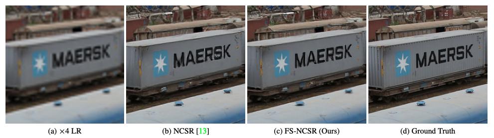
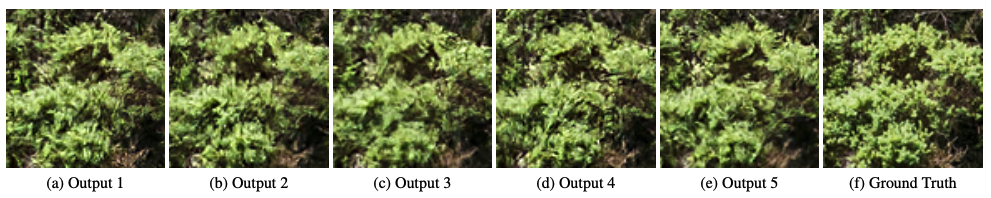

# FS-NCSR
Official PyTorch implementation of "FS-NCSR: Increasing Diversity of the Super-Resolution Space via Frequency Separation and Noise-Conditioned Normalizing Flow"  [[paper](https://openaccess.thecvf.com/content/CVPR2022W/NTIRE/html/Song_FS-NCSR_Increasing_Diversity_of_the_Super-Resolution_Space_via_Frequency_Separation_CVPRW_2022_paper.html)]

CVPRW 2022, Runner-up at NTIRE 2022 Learning the Super Resolution Space Challenge

This repository is heavily based on [SRFlow](https://github.com/andreas128/SRFlow) and [NCSR](https://github.com/younggeun-kim/NCSR)

<p align="center">
	
</p>

## Setup
### Environment
```.bash
python pip install -r requirements.txt
```
We recommand a virtual environment such as Anaconda for running this code.

### Preparing data
```.bash
python prepare_data.py /path/to/img_dir
```
### RRDB pretrained weights
Download pretrained weights of RRDB and place them into 'pretrained_weights' folder

[RRDB_DF2K_4X.pth](https://drive.google.com/file/d/1597Gblp_lsPEsyBuD8YrqelSMFbauObS/view?usp=sharing)\
[RRDB_DF2K_8X.pth](https://drive.google.com/file/d/1nyggiyxTZLAEOAjV6_x8UEmdoMdI5ulp/view?usp=sharing)

These pretrained weights are originally from [SRFlow](https://github.com/andreas128/SRFlow)

## Training

```.bash
python train.py -opt path/to/Confpath
```
* path/to/Confpath is model parameter script which is in code/confs/~.yml

## Test

```.bash
python eval.py --scale scale_factor --lrtest_path path/to/LRpath --conf_path path/to/Confpath
```
* To eval with pretrained model, please check model_path in Confpath. 
* Pretriained models should be in code/pretrained_model

## Results

<p align="center">
	
	
</p>
